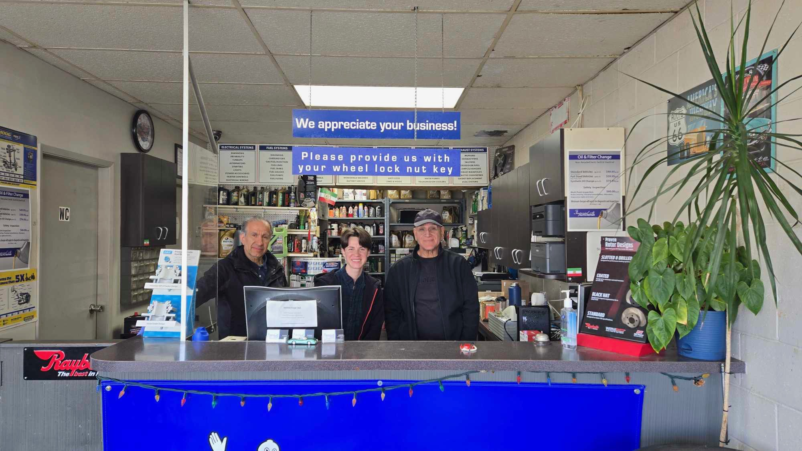

# Imperial Street Auto Repair — UI/UX Improvements & Remaining Work

**Last updated:** 2026-05-21  
**Site:** https://imperialst.ca  
**Repo:** BuildOrbitGit/ImperialStreetAuto  
**Stack:** Single-file static HTML · Hosted on Vercel

---

## ✅ Completed This Session

| Area | What was done |
|---|---|
| **Dark glassmorphic nav** | `backdrop-filter: blur(20px)`, scrolled shadow, mobile hamburger |
| **IST logo** | Replaced SVG placeholder with IST_logo.jpg; flood-fill bg removal; transparent PNG; invert filter for dark nav |
| **3D service sphere** | Replaced flat chip cloud with draggable Fibonacci sphere; auto-rotates |
| **Sphere → table click** | Click any sphere label → smooth scroll to services table → blue pulse highlight on matching rows |
| **Duplicate highlighting** | Services appearing in multiple columns (e.g. "Diagnosis") all highlight simultaneously |
| **Sphere hover preview** | Mouse-over sphere tag softly highlights matching table row without scrolling |
| **Mobile sphere touch** | Added explicit `touchstart/touchmove/touchend` handlers alongside pointer events for iOS Safari / Android |
| **Pricing grid** | 3-column dark grid: oil change tiers, inspection fees, specials with disclaimer |
| **Business hours** | Mon–Fri 9–5, Sat 9–4 corrected in JS, schema JSON, FAQ, contact section |
| **Walk time** | "8-min walk" → "2-min walk" from Royal Oak SkyTrain (2 locations) |
| **Vercel deploy** | `vercel.json` cache headers; all pushes auto-deployed via `vercel --prod` |

---

## 🔴 High Priority — Fix Soon

### 1. Logo — still needs a clean final version
The current logo uses CSS `filter: invert(1)` on a grey-background JPG. This inverts the crown to gold and text to white, which looks reasonable but isn't brand-accurate. **Ideal fix:**
- Ask client for a **transparent-background PNG or SVG** of the logo (exported from original design file)
- Drop it in as `IST_logo.png`, remove the `filter: invert()` from CSS
- The logo will then show its actual blue/grey/black colours seamlessly on the dark nav

### 2. Logo size & alignment on mobile
On screens < 390px the logo still feels large relative to the hamburger button. Target:
```css
@media (max-width: 390px) { .brand-logo { height: 36px; } }
```

### 3. Contact form — not wired to anything
Submitting the form only shows a "Request Ready" button flash. No email is sent. Options:
- **Formspree** (free tier, no backend): `<form action="https://formspree.io/f/YOUR_ID">`
- **Vercel serverless function** `api/contact.js` → sends email via Resend/SendGrid
- At minimum, add `mailto:` fallback

---

## 🟡 Medium Priority — Polish

### 4. Hero section — mobile text sizing
On phones the H1 (`clamp(2.55rem, 7vw, 5.8rem)`) clips at around 2.55rem which is fine, but the hero car image overlaps the text on screens < 480px. Fix:
```css
@media (max-width: 480px) {
  .hero-car { opacity: 0.25; bottom: 0; right: -60px; }
  .hero-content { padding-bottom: 60px; }
}
```

### 5. Sphere section — mobile height
At < 480px the sphere stage at `height: clamp(380px, 52vw, 580px)` works out to ~380px which is good, but the sphere tags near the edge get clipped. Consider reducing the radius multiplier on very small screens:
```js
const radius = size * (rect.width < 480 ? 0.30 : rect.width < 720 ? 0.36 : 0.40);
```

### 6. Services table — column heading alignment
On 2-column mobile layout the `service-col-head` labels left-align but the rows are centered, creating a visual mismatch. Ensure:
```css
.service-col-head { text-align: left; }
.service-row { text-align: left; }
```

### 7. Pricing grid — 1-column on mobile overflow
At 375px the pricing card `prow` rows with long descriptions (e.g. "Cars, Crossovers · up to 5L · 5w20/5w30/10w30") wrap awkwardly. Add:
```css
@media (max-width: 600px) {
  .prow-desc { font-size: 0.78rem; }
  .prow-price { font-size: 18px; }
}
```

### 8. Nav hamburger — closes on outside click
Currently the mobile menu only closes when a nav link is clicked. Tapping outside should also close it:
```js
document.addEventListener("click", (e) => {
  if (!navLinks.contains(e.target) && !menuToggle.contains(e.target)) {
    body.classList.remove("menu-open");
    menuToggle.setAttribute("aria-expanded", "false");
  }
});
```

### 9. Scroll-reveal timing — stagger on pricing cards
Currently all pricing cards reveal at once. A stagger delay makes it feel more polished:
```css
.pcat:nth-child(2) { transition-delay: 0.08s; }
.pcat:nth-child(3) { transition-delay: 0.16s; }
```

### 10. Sphere hint text — hide on mobile after first touch
The "Drag to rotate · Click to jump" hint stays visible permanently. Hide it after first interaction:
```js
stage.addEventListener("touchstart", () => {
  stage.querySelector(".sphere-hint").style.opacity = "0";
}, { once: true });
```

---

## 🟢 Low Priority — Nice to Have

### 11. Google Reviews widget
No social proof is visible above the fold. Options:
- Embed Elfsight Google Reviews widget (free tier)
- Scrape 3–5 reviews manually and add a static `.reviews-section` with star ratings
- Add Google rating badge near the CTA button

### 12. Before/After detailing gallery
The detailing section has placeholder image boxes. Replace with real before/after photos from the shop to increase conversion for detailing bookings.

### 13. Image optimisation
| File | Current | Recommended |
|---|---|---|
| `imperial-shop-clean.png` | ~2.3 MB | Convert to WebP, target < 300 KB |
| `hero-car-cutout.png` | ~2.2 MB | Convert to WebP, target < 400 KB |
| `team-photo.jpg` | ~425 KB | Re-compress, target < 150 KB |
| `IST_logo.jpg` | ~1.5 MB | Replace with transparent SVG or WebP, target < 80 KB |

```bash
# Quick conversion with cwebp:
cwebp -q 82 imperial-shop-clean.png -o imperial-shop-clean.webp
```

### 14. `loading="lazy"` on below-fold images
```html


```

### 15. Google Maps embed (iframe)
The map link currently opens Google Maps in a new tab. An embedded iframe in the contact section would reduce friction for mobile users trying to navigate:
```html
<iframe
  src="https://maps.google.com/maps?q=5186+Imperial+St+Burnaby+BC&output=embed"
  width="100%" height="220" style="border:0; border-radius:8px;" loading="lazy">
</iframe>
```

### 16. FAQ accordion — keyboard accessibility
The current FAQ uses `<details>/<summary>` which is keyboard accessible by default but the custom styling removes focus rings. Add:
```css
summary:focus-visible { outline: 2px solid var(--red); outline-offset: 3px; }
```

### 17. Footer — add phone number & social links
Footer currently has no phone number in text. Add:
```html
<a href="tel:+16044341120">(604) 434-1120</a>
```
And social placeholders for Google Business and any future Instagram.

### 18. `sitemap.xml` + `robots.txt`
No sitemap exists. For a single-page site:
```xml
<!-- sitemap.xml -->
<?xml version="1.0" encoding="UTF-8"?>
<urlset xmlns="http://www.sitemaps.org/schemas/sitemap/0.9">
  <url><loc>https://imperialst.ca/</loc><changefreq>monthly</changefreq></url>
</urlset>
```

---

## 📱 Mobile vs Desktop Audit Summary

| Element | Desktop | Mobile | Issue |
|---|---|---|---|
| Logo | ✅ Readable | ⚠️ Slightly large | Too big at < 390px |
| Nav | ✅ Full links | ✅ Hamburger works | Close-on-outside-click missing |
| Hero | ✅ Car + text balanced | ⚠️ Car overlaps text | Reduce car opacity on small screens |
| Sphere | ✅ Drags & clicks | ✅ Fixed (touch events) | Radius clips at 375px edge |
| Services table | ✅ 7 columns | ⚠️ 2→1 column OK | Col head/row alignment off |
| Pricing grid | ✅ 3 columns | ✅ 1 column | Long descriptions need smaller font |
| Process steps | ✅ 4 across | ✅ Stacked | Good |
| Reviews | ✅ Cards | ✅ Stacked | Good |
| FAQ | ✅ Accordion | ✅ Works | Missing focus ring |
| Contact form | ✅ 2-col | ✅ 1-col | Form not wired to email |
| Footer | ✅ 3-col | ✅ 1-col | Missing phone number |

---

## 🚀 Deploy Reference

```bash
# Work happens in the worktree branch
cd /Users/deepak/BuildOrbit/ImperialStreetAuto/.claude/worktrees/angry-lewin-4730b4/

# Edit index.html, commit in worktree
git add index.html && git commit -m "..."

# Merge to main and push
cd /Users/deepak/BuildOrbit/ImperialStreetAuto/
git merge claude/angry-lewin-4730b4 -X theirs
git push origin main

# Deploy to Vercel production
vercel --prod
```

**Live URL:** https://imperialst.ca  
**Vercel project:** buildorbitstudios-projects / imperial-street-auto
